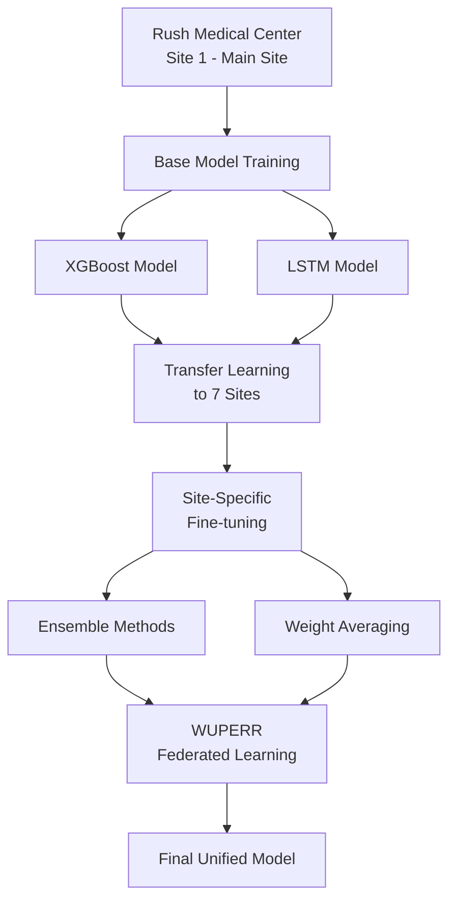
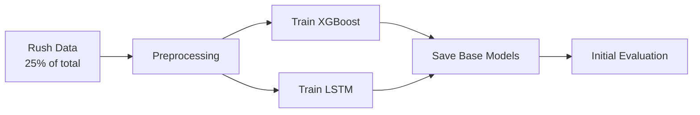
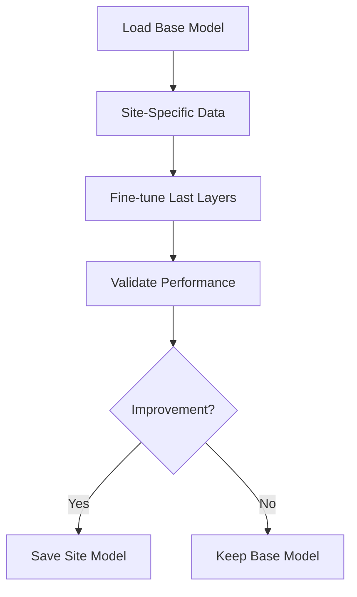
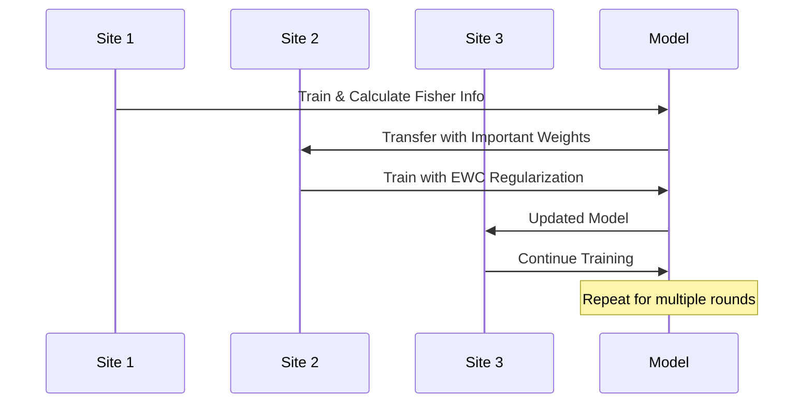
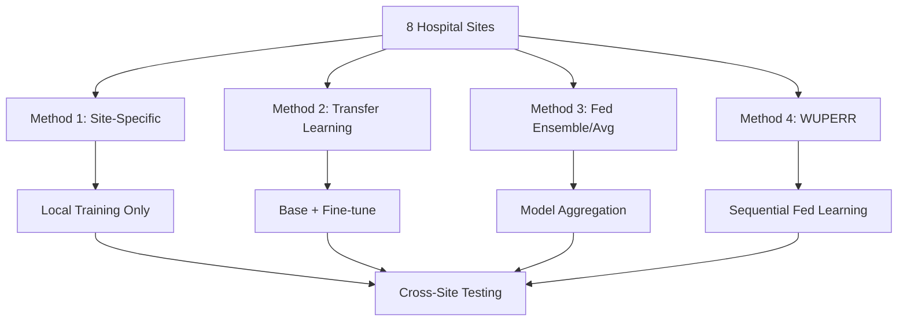

# FLAME-ICU: Multi-Site Federated Learning for ICU Mortality Prediction

## Project Overview

### FLAME-ICU Architecture
**Federated Learning Adaptable Mortality Estimator for Intensive Care Units**



### Site Distribution
- **8 Hospital Sites** with heterogeneous data characteristics
- **Total Data**: Split across sites with varying proportions
- **Target**: ICU mortality prediction (binary classification)

---

## Data Architecture

### Input Data Structure

#### Raw Data Format
- **Hourly ICU measurements** stored in wide format
- **Features**: Vital signs, lab values with `_max` and `_min` suffixes
- **Temporal**: 24-hour sequences per hospitalization
- **Format**: Parquet files for efficient storage

#### Feature Engineering
```
Original Features → Aggregation → Model Input
├── Vital Signs (HR, BP, RR, Temp)
├── Lab Values (Glucose, Sodium, Potassium, etc.)
└── Clinical Indicators
```

### Site-Specific Data Characteristics

| Site | Type | Data % | Characteristics | Bias |
|------|------|--------|-----------------|------|
| 1 | Large Academic | 25% | High acuity, complete data | Higher mortality |
| 2 | Large Community | 20% | Balanced patient mix | Balanced |
| 3 | Medium Academic | 15% | Research-focused | Research bias |
| 4 | Medium Community | 15% | General care | Balanced |
| 5 | Small Community | 10% | Low acuity cases | Lower mortality |
| 6 | Small Rural | 8% | Limited resources | 30% missing data |
| 7 | Specialty Hospital | 5% | Cardiac focus | Specific conditions |
| 8 | Critical Access | 2% | Basic care only | Basic metrics |

---

## Model Implementations

### 1. XGBoost Model (Aggregated Features)

#### Architecture
- **Input**: Aggregated features per hospitalization
- **Aggregation**: Min, Max, Median for each feature
- **Algorithm**: Gradient Boosting with early stopping
- **Class Balance**: Handled via `scale_pos_weight`

#### Key Parameters
```python
{
    "objective": "binary:logistic",
    "eval_metric": "logloss",
    "max_depth": 6,
    "learning_rate": 0.3,
    "subsample": 0.8,
    "colsample_bytree": 0.8,
    "scale_pos_weight": auto_calculated
}
```

#### Training Process
1. Load hourly data
2. Aggregate by hospitalization_id
3. Scale features
4. Train with early stopping
5. Evaluate on hold-out test set

### 2. LSTM Model (Sequential)

#### Architecture
```
Input (24 hours × features)
    ↓
LSTM Layer 1 (64 units)
    ↓
Dropout (0.2)
    ↓
LSTM Layer 2 (32 units)
    ↓
Dropout (0.2)
    ↓
Dense Layer (16 units, ReLU)
    ↓
Output Layer (1 unit, Sigmoid)
```

#### Key Features
- **Sequence Length**: 24 hours
- **Padding**: Zero-padding for shorter sequences
- **Loss**: BCEWithLogitsLoss with class weights
- **Optimization**: Adam with gradient clipping

### 3. WUPERR Model (Federated Learning)

#### Core Innovation
**Weighted Update with Partial Error Reduction and Regularization**


#### Key Components
1. **Fisher Information Matrix**: Identifies important weights
2. **Elastic Weight Consolidation (EWC)**: Prevents catastrophic forgetting
3. **Partial Updates**: Only significant gradients applied
4. **Sequential Learning**: Round-robin across sites

---

## Training Workflow

### Phase 1: Base Model Training at Rush (Site 1)



**Steps:**
1. Load Site 1 data (largest, most complete)
2. Train both XGBoost and LSTM models
3. Establish baseline performance metrics
4. Save models for transfer learning

### Phase 2: Transfer Learning at Other Sites



**For Each Site (2-8):**
1. Load pre-trained model from Site 1
2. Freeze early layers (LSTM) or use base as init (XGBoost)
3. Fine-tune on local data
4. Compare performance metrics
5. Save best performing version

### Phase 3: Model Aggregation

#### XGBoost Ensemble
```python
# Ensemble predictions from all sites
predictions = []
for site in sites:
    model = load_model(site)
    pred = model.predict(test_data)
    predictions.append(pred)
final_pred = np.mean(predictions, axis=0)
```

#### LSTM Weight Averaging
```python
# Average weights from all site models
averaged_weights = {}
for param_name in model.state_dict():
    param_sum = sum([site_model[param_name] for site_model in all_models])
    averaged_weights[param_name] = param_sum / num_sites
```

### Phase 4: WUPERR Federated Learning



---

## Evaluation Framework

### Primary Metrics
1. **ROC-AUC**: Main performance metric
2. **Accuracy**: Overall correctness
3. **Precision/Recall**: Class-specific performance
4. **F1-Score**: Balanced metric
5. **Calibration**: Probability reliability

### Evaluation Levels

#### 1. Site-Specific Evaluation
- Performance on local test set
- Comparison with base model
- Improvement tracking

#### 2. Cross-Site Evaluation
- Test each model on all other sites
- Measure generalization capability
- Identify site-specific biases

#### 3. Global Evaluation
- Combined test set from all sites
- Overall model performance
- Fairness across sites

### Visualization Suite
```
├── ROC Curves (per site & global)
├── Calibration Plots
├── Confusion Matrices
├── Feature Importance (XGBoost)
├── Training Progress
├── Site Performance Heatmap
└── WUPERR Contribution Analysis
```

---

## Run Sequence Plan (Minimal Effort Approach)

### Prerequisites
```bash
# Environment setup (one-time)
python -m venv flameICU
source flameICU/bin/activate  # or .\flameICU\Scripts\activate on Windows
pip install -r requirements.txt
```

### Execution Sequence

#### Step 1: Data Preparation (Automated)
```bash
# Split data across sites
python code/data/simulate_multisite.py \
    --data_path output/intermitted/by_hourly_wide_df.parquet \
    --num_sites 8 \
    --setup_only
```

#### Step 2: Base Model Training
```bash
# Train XGBoost at Site 1
python code/models/xgboost/training.py

# Train LSTM at Site 1  
python code/models/lstm/training.py
```

#### Step 3: Transfer Learning (Parallel Execution)
```bash
# Run for sites 2-8 in parallel
for site in {2..8}; do
    python code/models/xgboost/transfer_learning.py --site_id $site &
    python code/models/lstm/transfer_learning.py --site_id $site &
done
wait
```

#### Step 4: Model Aggregation
```bash
# XGBoost Ensemble
python code/models/xgboost/ensemble.py --method voting

# LSTM Weight Averaging
python code/models/lstm/weight_average.py --sites all
```

#### Step 5: WUPERR Federated Learning
```bash
# Run sequential federated learning
python code/models/federated/simulate_multisite.py \
    --num_rounds 3 \
    --config code/models/federated/config_federated.json
```

#### Step 6: Final Evaluation
```bash
# Comprehensive evaluation
python code/models/federated/evaluate.py \
    --test_data output/test/global_test_set.parquet
```

### Monitoring & Outputs

#### Real-time Monitoring
- Training logs in `logs/` directory
- Git commits for model improvements
- Progress bars for long operations

#### Final Outputs
```
output/
├── models/
│   ├── xgboost/
│   │   ├── base_model.json
│   │   ├── site_*/
│   │   └── ensemble/
│   ├── nn/
│   │   ├── base_model.pt
│   │   ├── site_*/
│   │   └── averaged/
│   └── federated/
│       └── federated_final.pt
├── results/
│   ├── site_statistics.csv
│   ├── performance_metrics.json
│   └── federated_evaluation_report.json
└── final/graphs/
    ├── model_comparisons.png
    ├── site_performance_heatmap.png
    └── roc_curves_all_models.png
```

---

## Model Input Specifications

### XGBoost Input
- **Shape**: (n_samples, n_aggregated_features)
- **Features**: ~150-200 aggregated features
- **Example**: `[HR_min, HR_max, HR_median, BP_sys_min, ...]`

### LSTM Input
- **Shape**: (n_samples, 24, n_features)
- **Features**: ~50-70 raw features per hour
- **Example**: 24-hour sequences of vital signs and labs

### Data Requirements per Site
| Site | Min Samples | Recommended | Max Missing |
|------|-------------|-------------|-------------|
| 1-2  | 5,000       | 10,000+     | 10%         |
| 3-4  | 3,000       | 7,000+      | 15%         |
| 5-6  | 1,500       | 4,000+      | 20%         |
| 7-8  | 500         | 2,000+      | 30%         |

---

## Expected Outcomes & Success Metrics

### Performance Targets
1. **Base Models (Site 1)**
   - XGBoost AUC: 0.75-0.80
   - LSTM AUC: 0.78-0.83

2. **Transfer Learning**
   - Average improvement: 3-5% per site
   - Maintain performance on small sites

3. **Ensemble/Averaging**
   - XGBoost Ensemble: +2-3% over best single
   - LSTM Averaged: More stable predictions

4. **WUPERR Federated**
   - Final AUC: 0.82-0.87
   - Balanced performance across sites
   - No catastrophic forgetting

### Key Advantages of This Approach
1. **Minimal Manual Intervention**: Automated scripts for all phases
2. **Parallel Processing**: Sites can train simultaneously
3. **Git-based Tracking**: Automatic versioning and history
4. **Flexible Architecture**: Easy to add/remove sites
5. **Comprehensive Evaluation**: Built-in analysis tools

### Troubleshooting Guide
| Issue | Solution |
|-------|----------|
| Memory errors | Reduce batch size in configs |
| Slow training | Enable GPU in PyTorch |
| Poor transfer | Adjust learning rates |
| Missing data | Imputation strategies included |
| Version conflicts | Use provided requirements.txt |

---

## Comprehensive Method Comparison Study

### Objective
Compare four different approaches across all 8 sites to determine the optimal learning strategy:
1. **Site-Specific Models** (trained only on local data)
2. **Transfer Learning Models** (base model + fine-tuning)
3. **Federated Ensemble/Averaging** (aggregated models)
4. **WUPERR Federated Learning** (sequential collaborative learning)

### Testing Matrix



### Comparison Framework

#### Method 1: Site-Specific Models
**Description**: Train models independently at each site using only local data

| Model Type | Training Data | Testing | Expected Performance |
|------------|---------------|---------|---------------------|
| XGBoost Site-Specific | Local site data only | Local + Cross-site | Overfit to local patterns |
| NN Site-Specific | Local site data only | Local + Cross-site | Poor generalization |

#### Method 2: Transfer Learning Models
**Description**: Pre-train at Site 1, then fine-tune at each site

| Model Type | Base Training | Fine-tuning | Expected Performance |
|------------|---------------|-------------|---------------------|
| XGBoost Transfer | Site 1 data | Each site data | Better generalization |
| NN Transfer | Site 1 data | Each site data | Improved local adaptation |

#### Method 3: Federated Ensemble/Averaging
**Description**: Combine models from all sites through aggregation

| Aggregation Method | Input Models | Combination Strategy | Expected Performance |
|-------------------|--------------|---------------------|---------------------|
| XGBoost Ensemble | All site models | Voting/Averaging predictions | Robust across sites |
| NN Weight Averaging | All site models | Average model weights | Stable performance |

#### Method 4: WUPERR Federated Learning
**Description**: Sequential learning across sites with catastrophic forgetting prevention

| Component | Mechanism | Purpose | Expected Performance |
|-----------|-----------|---------|---------------------|
| Fisher Information | Identifies important weights | Preserve knowledge | Best overall performance |
| EWC Regularization | Prevents forgetting | Maintain past learning | Balanced across sites |

### Detailed Testing Plan

#### Phase 1: Site-Specific Baseline (Method 1)
```bash
# Train independent models at each site
for site in {1..8}; do
    # XGBoost site-specific
    python code/models/xgboost/training.py \
        --site_id $site \
        --data_path data/sites/site_${site}_data.parquet \
        --output_suffix "_site_specific"
    
    # NN site-specific
    python code/models/nn/training.py \
        --site_id $site \
        --data_path data/sites/site_${site}_data.parquet \
        --output_suffix "_site_specific"
done
```

#### Phase 2: Transfer Learning (Method 2)
```bash
# Base model training at Site 1
python code/models/xgboost/training.py --site_id 1 --save_as_base
python code/models/nn/training.py --site_id 1 --save_as_base

# Transfer learning at sites 2-8
for site in {2..8}; do
    python code/models/xgboost/transfer_learning.py \
        --base_model output/models/xgboost/base_model.json \
        --site_id $site \
        --fine_tune_epochs 50
    
    python code/models/nn/transfer_learning.py \
        --base_model output/models/nn/base_model.pt \
        --site_id $site \
        --fine_tune_epochs 20
done
```

#### Phase 3: Federated Ensemble/Averaging (Method 3)
```bash
# XGBoost Ensemble
python code/models/xgboost/ensemble.py \
    --method voting \
    --input_models "output/models/xgboost/site_*/model.json" \
    --output_model output/models/xgboost/ensemble_model.json

# NN Weight Averaging
python code/models/nn/weight_average.py \
    --input_models "output/models/nn/site_*/model.pt" \
    --output_model output/models/nn/averaged_model.pt \
    --averaging_method "uniform"
```

#### Phase 4: WUPERR Federated Learning (Method 4)
```bash
# Sequential federated learning with WUPERR
python code/models/federated/sequential_train.py \
    --num_rounds 3 \
    --sites "1,2,3,4,5,6,7,8" \
    --model_type "both" \
    --config code/models/federated/config_federated.json
```

### Comprehensive Evaluation Matrix

#### Performance Comparison Table Template

| Method | Site 1 | Site 2 | Site 3 | Site 4 | Site 5 | Site 6 | Site 7 | Site 8 | Global | Avg |
|--------|--------|--------|--------|--------|--------|--------|--------|--------|--------|-----|
| **XGBoost Site-Specific** | - | - | - | - | - | - | - | - | - | - |
| **XGBoost Transfer Learning** | - | - | - | - | - | - | - | - | - | - |
| **XGBoost Ensemble** | - | - | - | - | - | - | - | - | - | - |
| **LSTM Site-Specific** | - | - | - | - | - | - | - | - | - | - |
| **LSTM Transfer Learning** | - | - | - | - | - | - | - | - | - | - |
| **LSTM Weight Averaging** | - | - | - | - | - | - | - | - | - | - |
| **WUPERR XGBoost** | - | - | - | - | - | - | - | - | - | - |
| **WUPERR LSTM** | - | - | - | - | - | - | - | - | - | - |

#### Cross-Site Generalization Matrix

**Test each model trained on Site X on data from Site Y**

```
Training Site →  1    2    3    4    5    6    7    8
Testing Site ↓
1               [--] [--] [--] [--] [--] [--] [--] [--]
2               [--] [--] [--] [--] [--] [--] [--] [--]
3               [--] [--] [--] [--] [--] [--] [--] [--]
4               [--] [--] [--] [--] [--] [--] [--] [--]
5               [--] [--] [--] [--] [--] [--] [--] [--]
6               [--] [--] [--] [--] [--] [--] [--] [--]
7               [--] [--] [--] [--] [--] [--] [--] [--]
8               [--] [--] [--] [--] [--] [--] [--] [--]
```

### Evaluation Metrics for Each Method

#### Primary Metrics (AUC-ROC)
- **Local Performance**: Model performance on its training site
- **Cross-Site Performance**: Model performance on other sites
- **Global Performance**: Model performance on combined test set
- **Generalization Score**: Average cross-site performance

#### Secondary Metrics
- **Accuracy, Precision, Recall, F1-Score**
- **Calibration Error**
- **Training Time**
- **Model Size**
- **Inference Speed**

### Automated Evaluation Pipeline

```bash
#!/bin/bash
# comprehensive_evaluation.sh

echo "Starting Comprehensive Method Comparison..."

# Phase 1: Site-Specific Models
echo "Phase 1: Training Site-Specific Models..."
python scripts/train_site_specific.py --all_sites

# Phase 2: Transfer Learning
echo "Phase 2: Transfer Learning..."
python scripts/train_transfer_learning.py --all_sites

# Phase 3: Federated Ensemble/Averaging
echo "Phase 3: Federated Aggregation..."
python scripts/train_federated_ensemble.py

# Phase 4: WUPERR Federated Learning
echo "Phase 4: WUPERR Training..."
python scripts/train_federated.py --rounds 3

# Phase 5: Cross-Evaluation
echo "Phase 5: Cross-Site Evaluation..."
python scripts/cross_site_evaluation.py \
    --methods "site_specific,transfer,ensemble,federated" \
    --sites "1,2,3,4,5,6,7,8" \
    --output_dir "results/comparison/"

# Phase 6: Generate Comparison Report
echo "Phase 6: Generating Comparison Report..."
python scripts/generate_comparison_report.py \
    --results_dir "results/comparison/" \
    --output_file "results/method_comparison_report.html"

echo "Evaluation Complete! Results saved to results/comparison/"
```

### Expected Results Analysis

#### Hypothesis Testing

| Hypothesis | Method | Expected Outcome | Validation Metric |
|------------|--------|------------------|-------------------|
| H1 | Site-specific models will overfit | Lowest cross-site performance | Cross-site AUC drop |
| H2 | Transfer learning improves generalization | Better than site-specific | Cross-site AUC improvement |
| H3 | Ensemble methods provide robustness | Most stable performance | Lower std dev across sites |
| H4 | WUPERR achieves best overall performance | Highest global AUC | Global test set performance |

#### Performance Prediction Matrix

| Site Type | Site-Specific | Transfer Learning | Ensemble/Avg | WUPERR |
|-----------|---------------|-------------------|---------------|---------|
| Large Academic (1-2) | Good local, poor cross | Good local, better cross | Balanced | Best overall |
| Medium (3-4) | Moderate local | Good improvement | Stable | Best overall |
| Small (5-6) | Poor due to data size | Significant improvement | Much better | Best overall |
| Rural/Specialty (7-8) | Very poor | Major improvement | Much better | Best overall |

### Visualization Suite for Comparison

#### 1. Performance Heatmap
```python
# Generate heatmap showing AUC for each method across all sites
sns.heatmap(performance_matrix, 
           annot=True, 
           fmt='.3f',
           xticklabels=sites,
           yticklabels=methods)
```

#### 2. Cross-Site Generalization Plot
```python
# Box plot showing performance distribution across sites for each method
plt.boxplot([site_specific_scores, transfer_scores, ensemble_scores, federated_scores])
```

#### 3. Training Data Size vs Performance
```python
# Scatter plot showing how much training data affects each method
plt.scatter(data_sizes, performances, c=methods)
```

#### 4. Method Ranking by Site
```python
# Radar chart showing method rankings for different site types
```

---

## Updated Run Sequence Plan

### Complete Method Comparison Execution

```bash
# Step 1: Setup and Data Preparation
python code/data/simulate_multisite.py --setup_only

# Step 2: Run All Methods in Parallel
./scripts/comprehensive_evaluation.sh

# Step 3: Generate Comparison Analysis
python scripts/method_comparison_analysis.py \
    --output_dir results/final_comparison \
    --generate_tables \
    --generate_plots \
    --statistical_tests

# Step 4: Create Final Report
python scripts/generate_final_report.py \
    --template templates/comparison_report.md \
    --output results/final_comparison/FLAME_ICU_Method_Comparison_Report.html
```

### Final Deliverables

1. **Performance Comparison Tables** - Detailed metrics for all methods across all sites
2. **Cross-Site Generalization Analysis** - How well models transfer between sites
3. **Statistical Significance Tests** - Which differences are statistically meaningful
4. **Computational Efficiency Analysis** - Training time, memory usage, inference speed
5. **Recommendations** - Which method to use for different scenarios
6. **Implementation Guide** - Step-by-step deployment recommendations

---

## Conclusion

This comprehensive comparison study will definitively answer:
- **Which method performs best overall?**
- **Which method generalizes best across diverse sites?**
- **Which method is most efficient to deploy?**
- **Which method is most robust to data heterogeneity?**

The automated evaluation pipeline ensures fair comparison while minimizing manual effort, providing clear evidence for the optimal federated learning approach for ICU mortality prediction.